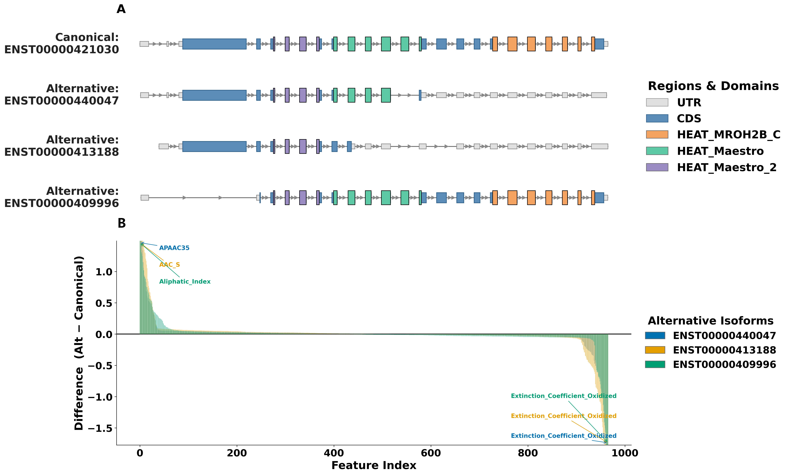
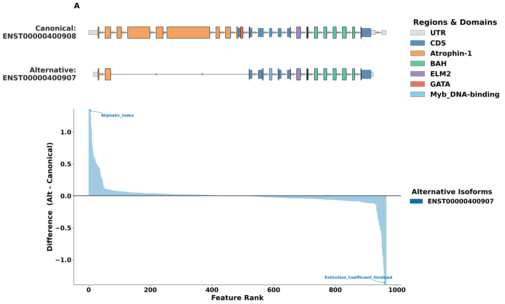

# IsoImpact

IsoImpact is an automated tool to evaluate the functional impact of alternative splicing based on isoform sequences. It integrates domain visualization across selected isoforms, protein feature extraction, and feature-difference analysis into a unified automated workflow.

## 1. Installation

Download IsoImpact from GitHub:

```bash
git clone https://github.com/HeBinYu666/IsoImpact.git
cd IsoImpact
```

IsoImpact is implemented in Python. It requires Python 3.8 or higher. The required Python packages are listed in `requirements.txt`:

```text
numpy>=1.21
pandas>=1.3
matplotlib>=3.5
biopython>=1.79
propy3>=1.1.1
```

Install these packages with:

```bash
pip install -r requirements.txt
```

## 2. Command-line options

IsoImpact uses the following command-line inputs:

```text
-i / --isoform   Ensembl isoform IDs to be compared. At least two isoform IDs are required.
-g / --gtf       Path to the GTF annotation file.
-f / --fasta     Path to the protein FASTA file.
-d / --domain    Path to the domain-coordinate file.
-o / --outdir    Directory where output files will be saved. The default is the current directory.
```

The isoform IDs (`-i`) must match the supplied GTF file. The GTF file (`-g`) provides isoform, exon, CDS, UTR, gene, and protein ID annotations for the selected isoforms. The protein FASTA file (`-f`) provides the corresponding amino acid sequences. The domain-coordinate file (`-d`) provides the protein-domain annotations used for domain comparison and visualization. For human and mouse analyses, IsoImpact provides pre-built domain-coordinate files under the `data/` directory.

These pre-built human and mouse domain-coordinate files were generated from Ensembl release version 110, so the human and mouse examples below use Ensembl release version 110 GTF and protein FASTA files to keep isoform IDs, protein IDs, genomic coordinates, and domain annotations consistent. Other Ensembl release versions or other species can also be used after generating a matching domain-coordinate file from the same annotation version.

### 2.1 Example usage using human isoforms

Step 1. Download the Ensembl release version 110 human GTF and protein FASTA files:

```bash
mkdir -p references

curl -L -o references/Homo_sapiens.GRCh38.110.gtf.gz \
  https://ftp.ensembl.org/pub/release-110/gtf/homo_sapiens/Homo_sapiens.GRCh38.110.gtf.gz

curl -L -o references/Homo_sapiens.GRCh38.pep.all.fa.gz \
  https://ftp.ensembl.org/pub/release-110/fasta/homo_sapiens/pep/Homo_sapiens.GRCh38.pep.all.fa.gz

gunzip references/Homo_sapiens.GRCh38.110.gtf.gz
gunzip references/Homo_sapiens.GRCh38.pep.all.fa.gz
```

Step 2. Run IsoImpact with four human Ensembl isoform IDs from the **MROH7 gene** (**ENSG00000184313**):

```bash
python IsoImpact.py \
  -i ENST00000421030 ENST00000440047 ENST00000413188 ENST00000409996 \
  -g references/Homo_sapiens.GRCh38.110.gtf \
  -f references/Homo_sapiens.GRCh38.pep.all.fa \
  -d data/human_domain.csv \
  -o results/human_isoforms
```

Because this example compares human isoforms, the command uses the human domain-coordinate file `data/human_domain.csv`.

After the command finishes, IsoImpact writes the output figure to:

```text
results/human_isoforms/IsoImpact_figure.png
```

`IsoImpact_figure.png` contains the domain-mapping visualization and ranked feature-difference plot for the input isoforms. An output figure from the four human MROH7 isoforms is available as [`data/example_output/IsoImpact_figure.png`](data/example_output/IsoImpact_figure.png).



IsoImpact also writes the feature matrix to:

```text
results/human_isoforms/IsoImpact_features.csv
```

`IsoImpact_features.csv` contains gene and isoform information, protein features, genomic span, and domain comparison results. A feature-matrix preview from four human MROH7 isoforms is shown below. The complete table is available as [`data/example_output/IsoImpact_features.csv`](data/example_output/IsoImpact_features.csv).

| Gene ID | Canonical isoform | Alternative isoform | Alternative domains | Lost domains | Gained domains | Total domain change |
| --- | --- | --- | --- | --- | --- | ---: |
| ENSG00000184313 | ENST00000421030 | ENST00000440047 | HEAT_Maestro_2; HEAT_Maestro | HEAT_MROH2B_C | None | 1 |
| ENSG00000184313 | ENST00000421030 | ENST00000413188 | HEAT_Maestro_2 | HEAT_Maestro; HEAT_MROH2B_C | None | 2 |
| ENSG00000184313 | ENST00000421030 | ENST00000409996 | HEAT_Maestro_2; HEAT_Maestro; HEAT_MROH2B_C | None | None | 0 |

### 2.2 Example usage using mouse isoforms

Step 1. Download the Ensembl release version 110 mouse GTF and protein FASTA files:

```bash
mkdir -p references

curl -L -o references/Mus_musculus.GRCm39.110.gtf.gz \
  https://ftp.ensembl.org/pub/release-110/gtf/mus_musculus/Mus_musculus.GRCm39.110.gtf.gz

curl -L -o references/Mus_musculus.GRCm39.pep.all.fa.gz \
  https://ftp.ensembl.org/pub/release-110/fasta/mus_musculus/pep/Mus_musculus.GRCm39.pep.all.fa.gz

gunzip references/Mus_musculus.GRCm39.110.gtf.gz
gunzip references/Mus_musculus.GRCm39.pep.all.fa.gz
```

Step 2. Run IsoImpact with mouse Ensembl isoform IDs:

```bash
python IsoImpact.py \
  -i ENSMUST00000112701 ENSMUST00000134301 \
  -g references/Mus_musculus.GRCm39.110.gtf \
  -f references/Mus_musculus.GRCm39.pep.all.fa \
  -d data/mouse_domain.csv \
  -o results/mouse_isoforms
```

Replace the example IDs with the mouse isoforms to be compared. Because this example compares mouse isoforms, the command uses the mouse domain-coordinate file `data/mouse_domain.csv`.

## 3. Generating Domain-Coordinate Files for Other Ensembl Versions or Species

For isoforms annotated in Ensembl release versions other than Ensembl release version 110, or for isoforms from another species, users can use the `build_custom_domain.R` script in the `scripts/` directory to generate a matching domain-coordinate file. The generated file should be used together with the GTF and protein FASTA files from the same annotation version. The example below uses two isoforms from the RERE gene in Ensembl release version 109 to demonstrate this process.

For this process, users need:

```text
1. A GTF file from the target Ensembl release version or species.
2. A protein FASTA file from the same Ensembl release version or species.
3. PfamScan domain-prediction results for the corresponding protein sequences.
```

Install the R packages used by `scripts/build_custom_domain.R`:

```r
install.packages("BiocManager")
BiocManager::install(c("AnnotationHub", "ensembldb", "GenomicRanges"))
install.packages("dplyr")
```

Step 1. Prepare the GTF and protein FASTA files.

First, download the Ensembl release version 109 human GTF file:

```bash
mkdir -p references

curl -L -o references/Homo_sapiens.GRCh38.109.gtf.gz \
  https://ftp.ensembl.org/pub/release-109/gtf/homo_sapiens/Homo_sapiens.GRCh38.109.gtf.gz

gunzip references/Homo_sapiens.GRCh38.109.gtf.gz
```

Second, to reduce the running time of the example workflow, use the FASTA file provided in this repository, which contains a small subset of protein sequences:

```text
data/example_release109/Homo_sapiens.GRCh38.pep.release109.example.fa
```

If users want to run the process on the full proteome, they can also download the complete Ensembl release version 109 human protein FASTA file from Ensembl:

```text
https://ftp.ensembl.org/pub/release-109/fasta/homo_sapiens/pep/Homo_sapiens.GRCh38.pep.all.fa.gz
```

Step 2. Generate PfamScan domain-prediction results.

First, install PfamScan:

```bash
conda create -n pfamscan -c conda-forge -c bioconda pfam_scan hmmer -y
conda activate pfamscan
```

Second, download and prepare the Pfam database:

```bash
mkdir -p references/pfam

curl -L -o references/pfam/Pfam-A.hmm.gz \
  https://ftp.ebi.ac.uk/pub/databases/Pfam/current_release/Pfam-A.hmm.gz

curl -L -o references/pfam/Pfam-A.hmm.dat.gz \
  https://ftp.ebi.ac.uk/pub/databases/Pfam/current_release/Pfam-A.hmm.dat.gz

curl -L -o references/pfam/active_site.dat.gz \
  https://ftp.ebi.ac.uk/pub/databases/Pfam/current_release/active_site.dat.gz

gunzip -f references/pfam/Pfam-A.hmm.gz
gunzip -f references/pfam/Pfam-A.hmm.dat.gz
gunzip -f references/pfam/active_site.dat.gz

hmmpress references/pfam/Pfam-A.hmm
```

Third, run PfamScan on the provided FASTA file:

```bash
mkdir -p results/release109_rere

pfam_scan.pl \
  -fasta data/example_release109/Homo_sapiens.GRCh38.pep.release109.example.fa \
  -dir references/pfam \
  -outfile results/release109_rere/RERE_release109_pfam_results.txt
```

Step 3. Generate an IsoImpact-compatible domain-coordinate file:

```bash
Rscript scripts/build_custom_domain.R \
  --gtf references/Homo_sapiens.GRCh38.109.gtf \
  --pfam results/release109_rere/RERE_release109_pfam_results.txt \
  --out results/release109_rere/RERE_release109_domain.csv \
  --ensembl 109
```

Step 4. Run IsoImpact with two human Ensembl isoform IDs from the **RERE gene** (**ENSG00000142599**) and the generated domain-coordinate file:

```bash
python IsoImpact.py \
  -i ENST00000400908 ENST00000400907 \
  -g references/Homo_sapiens.GRCh38.109.gtf \
  -f data/example_release109/Homo_sapiens.GRCh38.pep.release109.example.fa \
  -d results/release109_rere/RERE_release109_domain.csv \
  -o results/release109_rere
```

After the command finishes, IsoImpact writes the output figure to:

```text
results/release109_rere/IsoImpact_figure.png
```

`IsoImpact_figure.png` contains the domain-mapping visualization and ranked feature-difference plot for the input isoforms. An output figure from the two Ensembl release version 109 RERE gene isoforms is available as [`data/example_release109/RERE_release109_IsoImpact_figure.png`](data/example_release109/RERE_release109_IsoImpact_figure.png).



IsoImpact also writes the feature matrix to:

```text
results/release109_rere/IsoImpact_features.csv
```

`IsoImpact_features.csv` contains gene and isoform information, protein features, genomic span, and domain comparison results. A feature-matrix preview from the two Ensembl release version 109 RERE gene isoforms is shown below. The complete table is available as [`data/example_release109/RERE_release109_IsoImpact_features.csv`](data/example_release109/RERE_release109_IsoImpact_features.csv).

| Gene ID | Canonical isoform | Alternative isoform | Alternative domains | Lost domains | Gained domains | Total domain change |
| --- | --- | --- | --- | --- | --- | ---: |
| ENSG00000142599 | ENST00000400908 | ENST00000400907 | BAH; ELM2; Myb_DNA-binding; Atrophin-1 | GATA | Myb_DNA-binding | 2 |

## 4. Contact

If you have questions about installing or running IsoImpact, or if you find an error in the code or documentation, please contact:

- Bin-Yu He: hzb022119@163.com
- Hong-Dong Li: hongdong@csu.edu.cn

You can also click the **Issues** tab at the top of this GitHub page to report problems.
